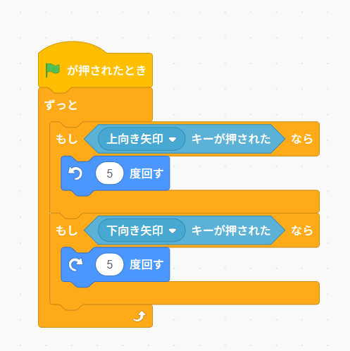
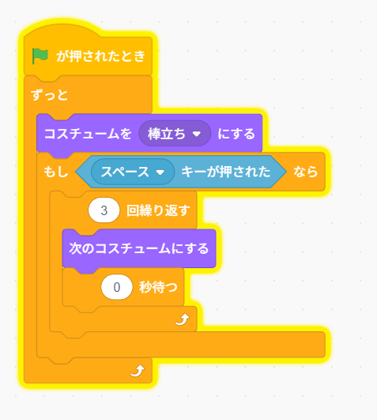
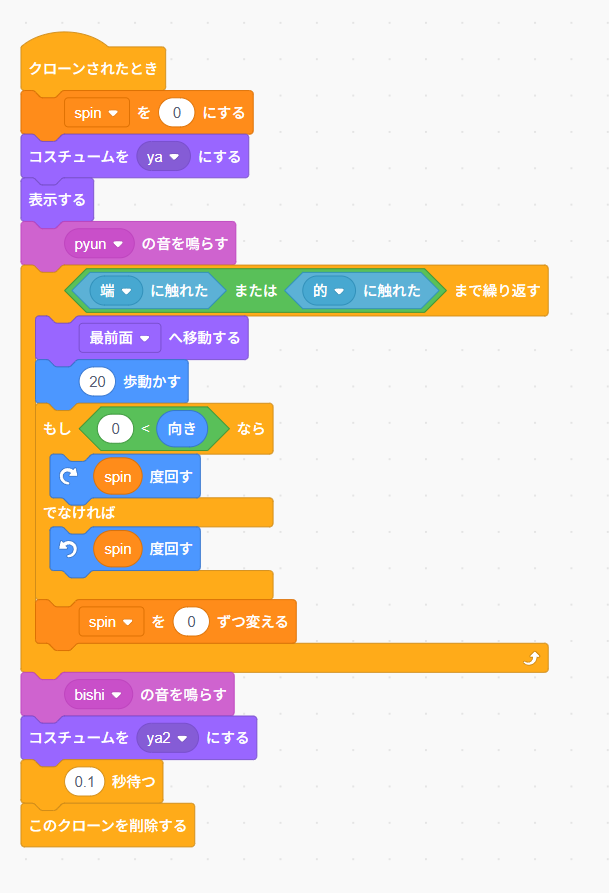
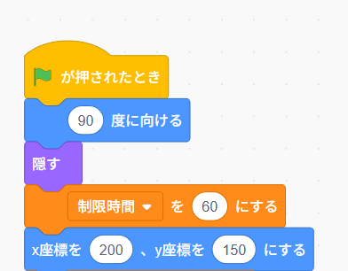
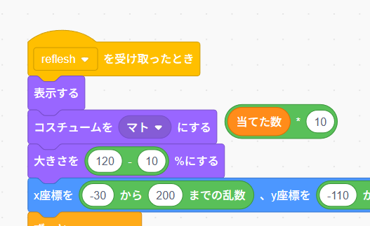
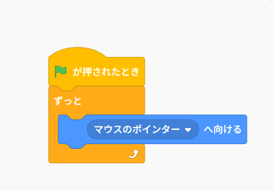
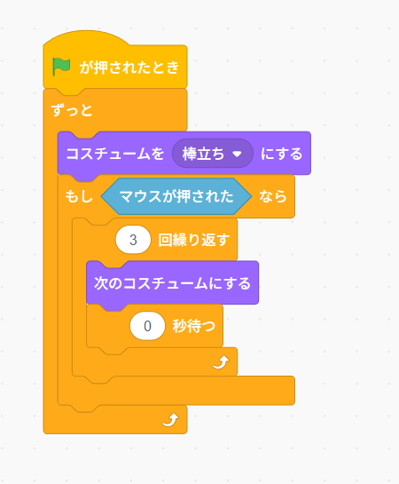

# Scratchでゲームをつくってみよう！

---

# 今日やること

- Scratchでゲームを完成させる
- 最強のゲームに改造する
- みんなのゲームをあそぶ

---

# はじめかた

## リミックスする

- https://scratch.mit.edu/projects/1251895280/ にアクセスする
- リミックスするボタンを押す

- これで自分のプロジェクトになりました！

---

# 実際に動かしてみる

- 緑の旗をクリックすると遊ぶ画面に行けるよ！
- 遊べるかな...?

---

# どうだったかな？

- みんなで思ったことを共有してみよう！

---

# ゲームを直そう！

- 矢印の向きが逆だね

---

# コードを編集する

- 「中を見る」をクリック

- ゲームを動かしている仕組みを触れるよ！

---

# 矢印を直す

-  「エルフ」のアイコンを見てみよう
  - 上向き矢印キーが押されたらどうしたいかな？
  - 下向き矢印キーが押されたらどうしたいかな？

---

# 矢印を直す

## 場所「エルフ」

- 上向き矢印キーが押されたら
  - 矢印を上に向かって動かす
- 下向き矢印キーが押されたら
  - 矢印を下に向かって動かす

---

## 遊んでみよう！

何点取れるかな？

---

# 難しかったかな？

ゲームを簡単にしてみよう！
ゲームの中身を見て、どうすれば簡単になるか考えてみよう！

---

# ミッション

- 矢を連射できるようにしよう！
- 矢が直線で飛ぶようにしよう！
- 制限時間を1分にしよう！
- 的の大きさが変わらないようにしよう！
- マウスで狙いがつけられるようにしよう！
- マウスのクリックで矢を打てるようにしよう！

---

# 矢を連射できるようにする

## 場所「エルフ」

- 今はスペースキーを押してから矢が飛ぶまでに少し時間がかかるね
- すぐ飛ぶようにしたらもっと楽になる！

---

# 矢が直線で飛ぶようにする

## 場所「矢」

- 今は矢が山なりに飛んでいるね
- まっすぐ飛べばもっと楽になるかも！

---

# 制限時間を1分にする

## 場所「制限時間」

- 今は30秒に設定されているね
- もっと多くすればもっと楽になるかも！

---

# 的の大きさが変わらないようにする

## 場所「的」

- 今は的の大きさが変わっているね
- 変わらないようにすればもっと楽になるかも！

---

# マウスで狙いをつけられるようにする

## 場所「エルフ」

- 今は矢印キーで狙っているけど、マウスで狙えたらもっと楽になる！

---

# マウスのクリックで矢を打てるようにする

## 場所「エルフ」

- 今はスペースキーを押して矢を飛ばしているね
- マウスのクリックで矢を打つようにしたらもっと楽になる！

---
# チャレンジ

- 今の状態で何点取れるか試してみよう！！

---

# みんなのチートを共有してみよう！

- ほかに思いついたアイデアをみんなで話してみよう！

---

# ありがとうございました

宿題：もっといろいろなゲームを触ってみよう！

[このリンク](https://scratch.futurecraft.jp/) からアクセスできるよ！

