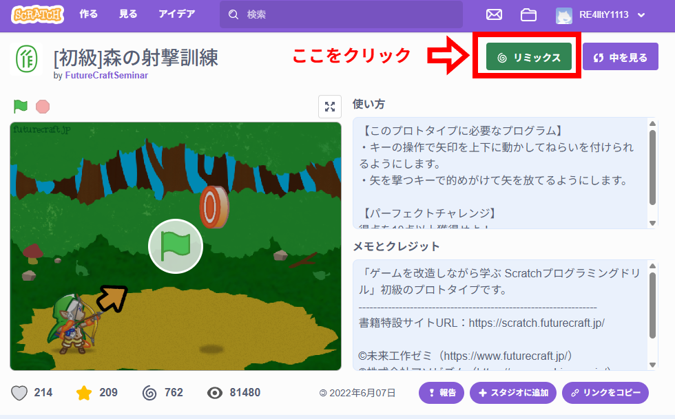
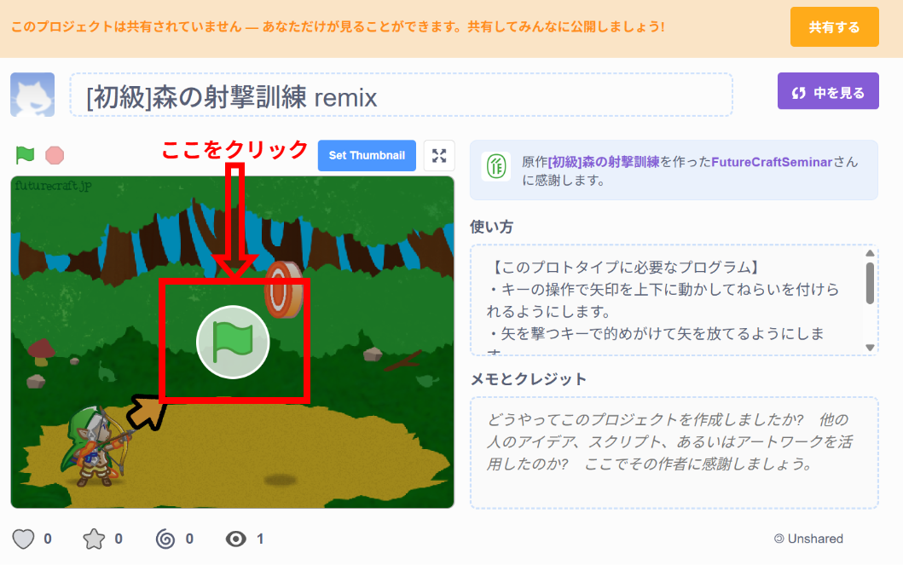
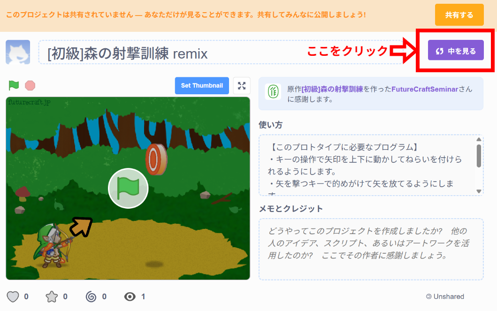
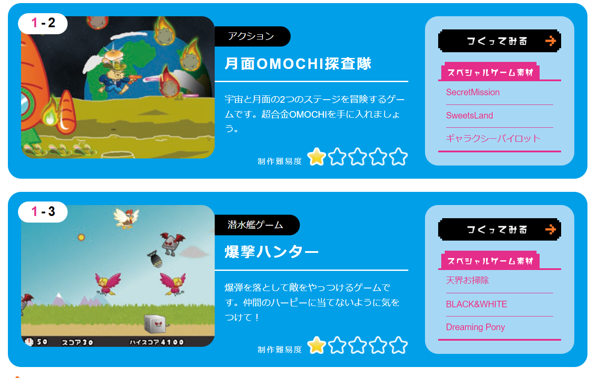

# Scratchでゲームをつくってみよう！

---

# 今日やること

- Scratchでゲームを完成させる
- 最強のゲームに改造する
- みんなのゲームをあそぶ

---

# はじめかた

## リミックスする

- https://scratch.mit.edu/projects/1251895280/ にアクセスする
- リミックスするボタンを押す

- これで自分のプロジェクトになりました！

---

# 実際に動かしてみる

- 緑の旗をクリックすると遊ぶ画面に行けるよ！
- 遊べるかな...?

---

# ゲームを直そう！

- 今の状態だとゲームは動かないね。
- キーの操作で矢印を上下に動かしてねらいを付けられるようにしよう
- 矢を撃つキーで的めがけて矢を放てるようにしよう

---

# コードを編集する

- 「中を見る」をクリック

- ゲームを動かしている仕組みを触れるよ！

---

# 矢を撃てるようにしよう

(画面共有)

---

# 狙いをつけられるようにする

(画面共有)

---

# 自分のタイミングで矢を撃てるようにする

(画面共有)

---

# チートしてみよう！

- スコアが大きくなると、どんどん難しくなる
  - 

---

# ありがとうございました

宿題：もっといろいろなゲームを触ってみよう！

[このリンク](https://scratch.futurecraft.jp/) からアクセスできるよ！

